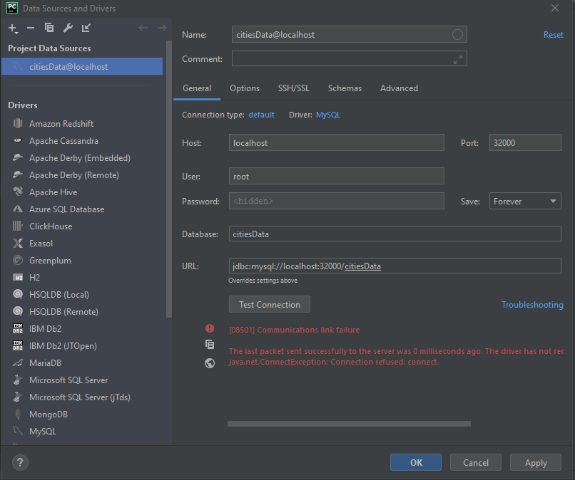

# PROJECT DESCRIPTION (PART TWO)
This project is a homework to teach students on
how to get Pycharm set up with Docker, Flask, MySQL, and Postman

# POSTMAN SCREENSHOT

Unable to perform a GET request through Postman

# SQL DATA SCREENSHOT

Unable to get a successful test connection

